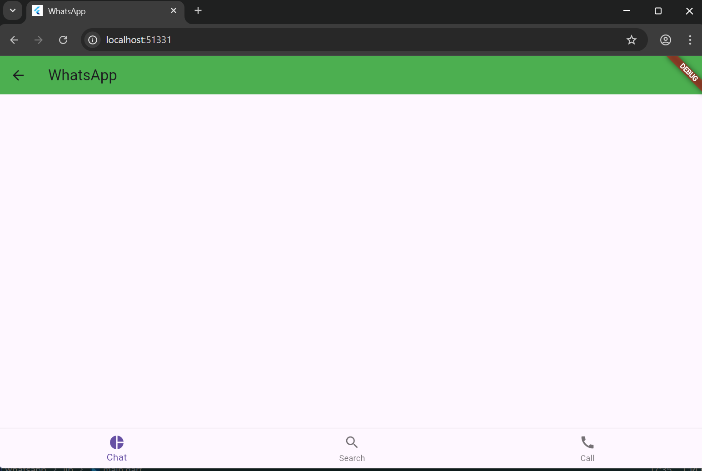

# whatsapp
💬 WhatsApp Clone (Flutter)
Flutter • Dart • Cross-Platform UI
A high-fidelity UI clone of WhatsApp, engineered to replicate the seamless communication experience across all form factors. This project focuses on adaptive architecture, ensuring the interface feels native whether on a smartphone, tablet, or desktop browser.
> ⚠️ Disclaimer > This project is for educational and portfolio purposes only. It is an independent UI study and is not affiliated with WhatsApp or Meta.
> 
📸 App Preview

 
 
 
📖 Table of Contents
 * ✨ Features
 * ⚙️ Tech Stack
 * 📂 Project Structure
 * ▶️ How to Run Locally
 * 🎯 Project Goal
 * 🛡️ License
✨ Features
 * Responsive Engine: Dynamic layout switching based on screen constraints.
 * Main Dashboard: Replicated chat list with real-time-style timestamps.
 * Status & Calls: Dedicated UI sections for stories and call logs.
 * Web-Ready: Fully functional on Chrome/Edge (as seen in your Android Studio logs).
 * Adaptive Widgets: Custom components that resize intelligently for Desktop vs. Mobile.
⚙️ Tech Stack
 * Framework: Flutter
 * Language: Dart
 * Design: Material Design 3
 * Platforms Supported: 📱 Android, 🍎 iOS, 🌐 Web, 💻 Desktop (Win/Mac/Linux)
📂 Project Structure
Following a clean, screen-based architecture for easy maintenance:
lib/
├── main.dart                  # App entry point

▶️ How to Run Locally
Prerequisites
 * Flutter SDK (3.x+)
 * Android Studio / VS Code
 * Chrome (for Web testing)
Installation & Run
 * Clone the repository
   git clone [https://github.com/MrParzi/whatsapp/edit/main]

 * Install dependencies
   flutter pub get

 * Run the app
   flutter run

🎯 Project Goal
The objective of this project is to master Responsive UI Management in Flutter. By replicating a complex, world-class app like WhatsApp, I have implemented layout logic that handles the transition from mobile touch-points to desktop mouse-and-keyboard interactions seamlessly.
🛡️ License
This project is licensed under the MIT License.
👨‍💻 Developer Praise Victor Flutter Developer
